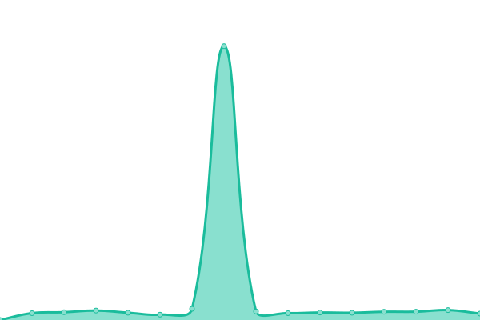
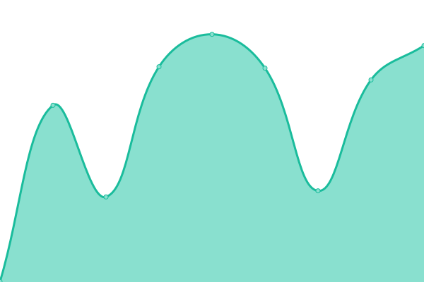

# [📈 Live Status](https://Fllorent0D.github.io/beping_upptime): <!--live status--> **🟩 All systems operational**

This repository contains the open-source uptime monitor and status page for [Florent Cardoen](https://www.floca.be), powered by [Upptime](https://github.com/upptime/upptime).

With [Upptime](https://upptime.js.org), you can get your own unlimited and free uptime monitor and status page, powered entirely by a GitHub repository. We use [Issues](https://github.com/Fllorent0D/beping_upptime/issues) as incident reports, [Actions](https://github.com/Fllorent0D/beping_upptime/actions) as uptime monitors, and [Pages](https://Fllorent0D.github.io/beping_upptime) for the status page.

<!--start: status pages-->
<!-- This summary is generated by Upptime (https://github.com/upptime/upptime) -->
<!-- Do not edit this manually, your changes will be overwritten -->
<!-- prettier-ignore -->
| URL | Status | History | Response Time | Uptime |
| --- | ------ | ------- | ------------- | ------ |
|  [BePing Backends](https://api-v2.beping.be/v1/health/context) | 🟩 Up | [be-ping-backends.yml](https://github.com/BePing/beping_upptime/commits/HEAD/history/be-ping-backends.yml) | 

 578ms
     
 | 

<a href="https://status.beping.be/history/be-ping-backends">100.00%</a>
    

|  [BePing Backends x AFTT/VTTL connectivity](https://api-v2.beping.be/v1/health) | 🟩 Up | [be-ping-backends-x-aftt-vttl-connectivity.yml](https://github.com/BePing/beping_upptime/commits/HEAD/history/be-ping-backends-x-aftt-vttl-connectivity.yml) | 

 292ms
     
 | 

<a href="https://status.beping.be/history/be-ping-backends-x-aftt-vttl-connectivity">100.00%</a>
    

|  [AFTT API](https://api.aftt.be/?wsdl) | 🟩 Up | [aftt-api.yml](https://github.com/BePing/beping_upptime/commits/HEAD/history/aftt-api.yml) | 

 1358ms
     
 | 

<a href="https://status.beping.be/history/aftt-api">100.00%</a>
    

|  [VTTL API](https://api.vttl.be/?wsdl) | 🟩 Up | [vttl-api.yml](https://github.com/BePing/beping_upptime/commits/HEAD/history/vttl-api.yml) | 

 1341ms
     
 | 

<a href="https://status.beping.be/history/vttl-api">100.00%</a>
    

<!--end: status pages-->

[**Visit our status website →**](https://Fllorent0D.github.io/beping_upptime)

## 📄 License

- Powered by: [Upptime](https://github.com/upptime/upptime)
- Code: [MIT](./LICENSE) © [Florent Cardoen](https://www.floca.be)
- Data in the `./history` directory: [Open Database License](https://opendatacommons.org/licenses/odbl/1-0/)
